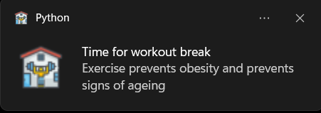

# Health Reminder application using Python

# Reminder app using Python
Health Reminder is a python application that uses pygame and plyer to remind the user to drink water, Workout and Relax your eyes.

## How to run?
### STEPS:

Clone the repository

```
https://github.com/aravind9722/Health_reminder.py.git
```
### STEP 01- Create a conda environment after opening the repository

```
conda create -p venv python=3.9.12 -y
```

```
conda activate venv
```

### STEP 02- install the requirements
```
pip install -r requirements.txt
```
### STEP 03- Change your input you need in Config.yaml interval_config
```
interval_config:
  workout_interval: 10
  drinkwater_interval: 10
  eyes_relax_interval: 30
  user_commands:
    - DONE
    - done
    - Done
```
### STEP 03- run app.py
```
python health_reminder.py
```

- **Timelogs of our work are stored in all_logs directory in timelogs folder**
- **Application logs are stored in all_logs directory pylogs folder.**

## Demo
### Workout Reminder

### Water Reminder

### Eyerelax Reminder


## Built With

1. Pygame
2. Plyer 
3. Python (Python 3.9.12)


## Authors
iNeuron Private limited
Aravind
